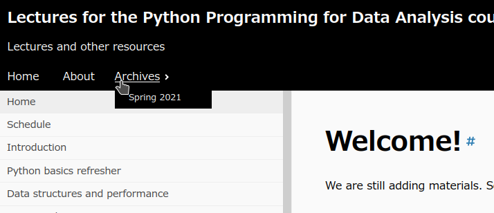

# Lectures for the Python Programming for Data Analysis course

## Publishing technology

The content is rendered and published using a static site generator
(or [Jamstack](https://jamstack.org/)) system
called [Hugo](https://gohugo.io/). It is primarily built by combining
two Hugo
themes, [Techdoc](https://themes.gohugo.io/hugo-theme-techdoc/)
and [reveal-hugo](https://themes.gohugo.io/reveal-hugo/). Techdoc
provides the documentation-style browsing of book chapters and
reveal-hugo provides the capability of online accessible chapter
presentations using the [reveal.js](https://revealjs.com/) technology.

The generated site can then be hosted on any static host (such
as [Github Pages](https://pages.github.com/)
or [Netlify](https://www.netlify.com/)). The original repository is
rendered and hosted on Github Pages and it is automatically generated
at each push by
using [Github's Actions](https://github.com/features/actions)
feature. You can see it in action in
[this example](https://soft-eng-practicum.github.io/softdev2-resources/).

## How to adopt this book and customize for your class

You can _fork_ this repository on Github and customize the chapters and
slides. See the links above to learn more about the different
technologies used.

Once you fork this repository, Github will carry over the Github
Actions instructions needed for automatic deployment, but you would
need to click on the "Actions" tab and enable them again in the
fork. After this, you should see the "Hugo" action listed, which will
be executed after each of your commits. The action will run Hugo and
write its output to the root of the `gh-pages` branch.

To enable Github Pages render this output, you need to go to the
Settings tab, scroll down and select to produce the pages from the
root folder of the `gh-pages` branch.

Don't forget to edit the `config.toml` file for changing variables
such as `baseURL`, `github_repository`, `github_doc_repository`,
`author`, `course`, and `google_analytics_id`.

## Reveal-Hugo customizations

In the class presentations, the `author` and `course` front-matter
variables will take precendence over the values in the `config.toml`
file. They are used in the following
custom
[Hugo shortcodes](https://gohugo.io/content-management/shortcodes/)
that we defined:

- `reveal-titlepage`: Puts the chapter title, course name (`course`
  parameter in page or in `config.toml` file), authors (`author`
  parameter), with an option to display a cover image, followed by the
  `reveal-prevnext-links` shortcode. The default format for the title
  page and its contents, such as authors can be changed in
  `layouts/shortcodes/reveal-titlepage.html`. It accepts the following
  optional parameters with the regular HTML syntax `param="value"`:
  - `figure`: Displays the cover image specified at given
    URL. If you create an image `/static/images/image.jpg`, you can
    refer to it with the base URL like this:
    `figure="/softdev2-resources/images/image.jpg"`.
  - `height`: Change the default height of `"300px"`.
  - `class`: Change CSS `class` of the `figure` tag.
  - `link`: Make the figure a link to this URL.
  - `alt`: Provide an alternate text to image.
  - `title`: Create a `<figcaption>` tag under the image.
  - `caption`: Set `alt` and also write it under the `figcaption`.
  - `attr`: Attribution text, shows up after caption.
  - `attrlink`: Link for the attribution.

- `reveal-prevnext-links`: Inserts links to previous and next Reveal
  chapters, which are automatically determined by following the pages
  in the folders. It has no additional options.

## Archiving old semesters

Since this site is organized with page articles rather than blog
posts, archiving is not trivial. But, one can take advantage of the
`gh-pages` branch commits that were built for older versions of the
site. 

Follow the steps:

1. Make new branches of the source on `master` and of the pre-built site
   pages on `gh-pages` that correspond to time of archive,
   respectively (e.g., `archive-sp21` and `gh-pages-sp21`).
1. On the archive source branch, change the `config.toml`:
   1. Add a prefix path to the `baseURL` parameter to have archive in
      a subfolder. Appended `sp21/` in this example:
      ```toml 
      baseURL = "https://cengique.github.io/lectures-prog-data-analysis/sp21"
      ```
   1. Add a menu item to go back to the current/latest site:
      ```toml
      [menu]
        ...
        
        [[menu.main]]
            name = "Go back..."
            url = "../"
            weight = 3
      ```
   1. Run these shell commands to add the archive site pages (e.g.,
      `gh-pages-s21`) as a worktree under `public/` and run Hugo to
      re-generate the site on that branch (non-master branches are not
      auto-generated by Github Actions):
      ```sh
      $ git worktree add -B gh-pages-21 public origin/gh-pages-21
      $ hugo
      ```
      Commit and push changes on the branches `archive-sp21` and
      `gh-pages-sp21`. Hint: for the latter, simply `cd public` and
      `git add/commit/push`.
      Remove the worklist from `public/` by:
      ```sh
      gt worktree remove public 
      ```
1. On the master branch, 
   1. Change the Github Action to insert the pre-built archive site
      files during regeneration. Edit `.github/workflows/hugo.yml` to
      add these two items under `steps:`
      ```yml
       - name: Checkout
         uses: actions/checkout@v2
         with:
            ref: gh-pages-sp21
            path: public/sp21
            submodules: 'true'

       - name: Remove git
         run: rm -rf public/sp21/.git
      ```
      Last step removes the git information to prevent `git add` from
      ignoring the `sp21` folder.
   
   1. Also change the `config.toml` to add a pull-down menu to select archives:
      ```toml
      [menu]
        ...
        
        [[menu.main]]
            identifier = "archives"
            name = "Archives"
            weight = 3
        
        [[menu.main]]
            name = "Spring 2021"
            url = "/sp21/"
            weight = 1
            parent = "archives"
      ```
   1. `git add/commit/push` to update the site.
   
*Hint: You must make one last commiton the `master` branch to trigger
the workflow and the archive to show up.*

It should look like this on the main site:



And like this on the archive site (in this example, under `sp21/`):


